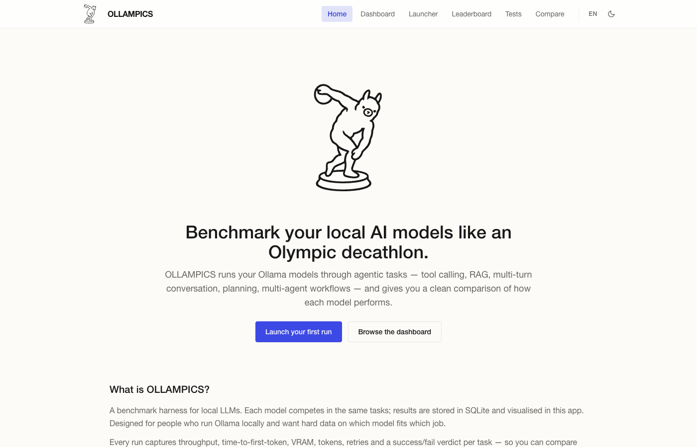
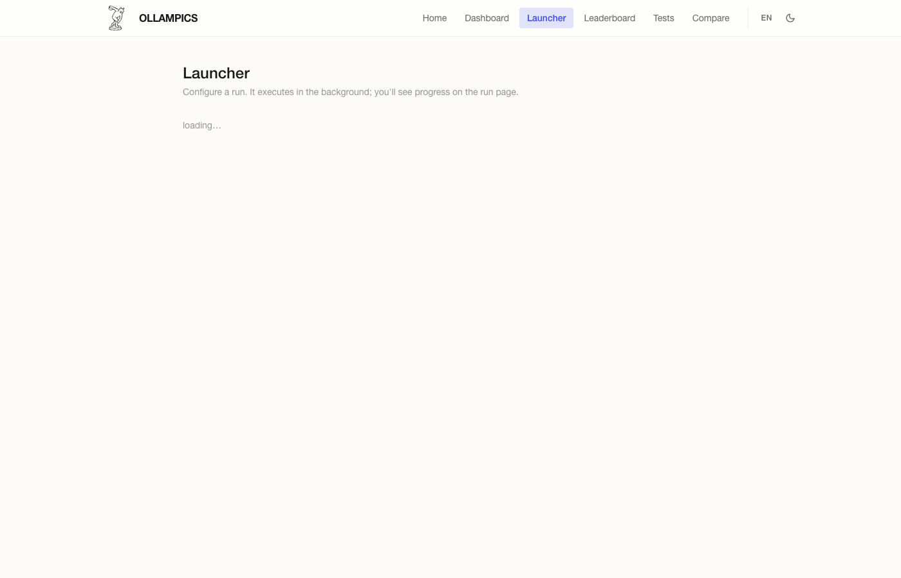
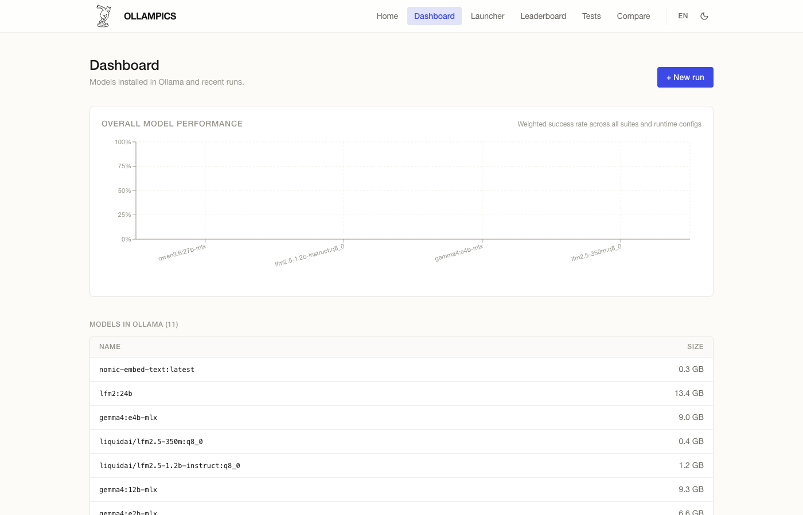
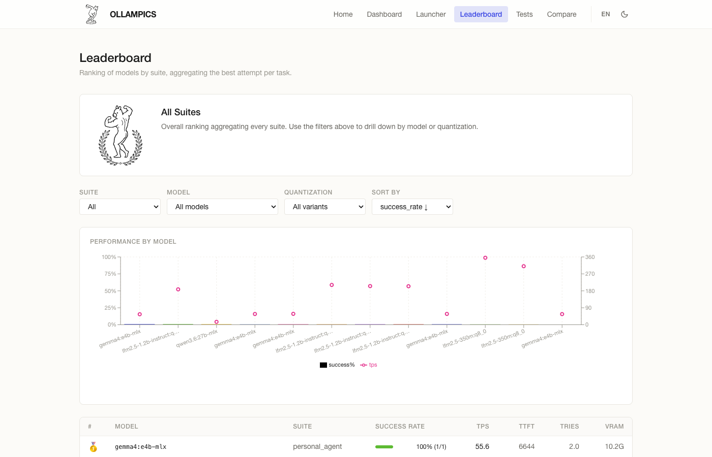
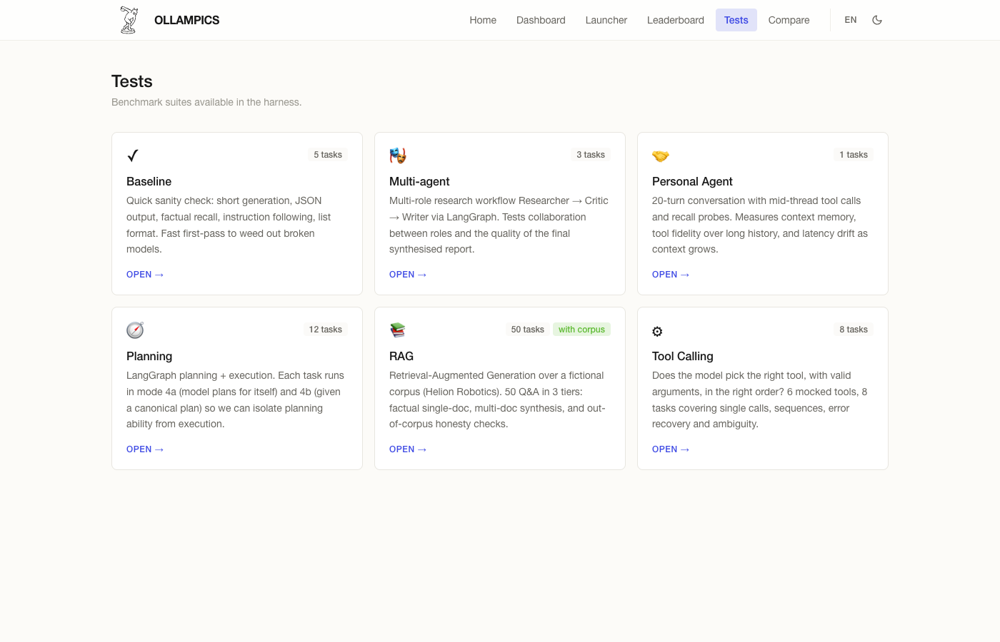

# OLLAMPICS

**English** · **[Español](README.es.md)**

[](LICENSE) [](https://www.python.org/) [](https://docs.astral.sh/uv/) [](https://ollama.com)

> Benchmark your local AI models like an Olympic decathlon.

OLLAMPICS runs your Ollama models through agentic tasks — tool calling, RAG, multi-turn conversation, planning, multi-agent workflows — and gives you a clean, reproducible comparison of how each model performs on your hardware.



## Why this exists

There are plenty of academic benchmarks for large, closed LLMs, but very few aimed at the models you actually run **locally** with Ollama. If you want to know which quantization of model X performs best on your Mac, or whether the new model Y actually beats your current favorite for *your* use case, you have to run it yourself. OLLAMPICS automates that:

- Define tasks in YAML (or use the ones that ship with it).
- Launch runs from the UI or the CLI.
- Capture real metrics: throughput, TTFT, VRAM, watts, success rate.
- Store everything in SQLite — reproducible, no cloud, no accounts.

Single-machine by design. DeepSeek is used **only as an optional judge** in RAG / planning suites. The rest is 100% local.

---

## Install

You need:

- [Ollama](https://ollama.com/download) running on `localhost:11434`
- At least one model pulled: `ollama pull qwen3.6:27b-mlx`
- Python 3.12+ via [`uv`](https://docs.astral.sh/uv/) (not `pip`)
- Node 20+ (only if you'll touch the frontend in dev)

```bash
git clone https://github.com/<your-fork>/ollampics
cd ollampics

# Backend
uv sync                       # creates .venv and installs everything
uv run oly db init            # creates data/ollampics.db

# Frontend (only the first time)
cd frontend && npm install && cd ..
```

### Environment variables (optional)

Copy `.env.example` to `.env` and adjust if needed:

- `LLM_API_KEY` — only required if you run the RAG / planning suites (they use DeepSeek as a judge).
- `OLLYMPICS_OLLAMA_HOST` — set if Ollama isn't on `http://localhost:11434`.
- `OLLYMPICS_ENABLE_WATTS=true` — capture GPU power via `powermetrics` (macOS, requires sudo).

---

## How to use the app

Two terminals, two servers:

```bash
# Terminal 1 — backend at http://localhost:8000
uv run oly serve --port 8000 --reload

# Terminal 2 — frontend at http://localhost:5173
cd frontend && npm run dev
```

Open `http://localhost:5173`. The Vite dev server proxies `/api/*` to the backend automatically.

### 1 · Home — what each piece does

The landing page visually explains what OLLAMPICS is, how to use it in 3 steps, which suites are available, and what each metric means (tps, ttft, vram, watts, success_rate).

### 2 · Launch a run

Go to **Launcher**: tick the models discovered in Ollama, the suites you want to run, set `num_ctx` and `kv_cache`. Hit launch.



### 3 · Watch progress live

The **Dashboard** lists recent runs with status badges. Each run opens a detail page with a WebSocket connection: you see every attempt as it lands, with TTFT, TPS and verdict. From here you can also delete old runs.



### 4 · Compare models on the Leaderboard

The **Leaderboard** aggregates the best attempts per `(model, runtime, suite)` and ranks them. The top 3 get medals 🥇 🥈 🥉. Filters by suite, model and quantization.



### 5 · Tests and corpus

The **Tests** page shows the available suites with their individual tasks and (for RAG) the corpus + the prompts that generated that corpus.



### CLI mode (no frontend)

```bash
uv run oly models list                                # list models in Ollama
uv run oly suites                                     # list available suites
uv run oly run --models qwen3.6:27b-mlx --suites baseline
uv run oly results show                               # latest run
uv run oly sweep --models X,Y --num-ctx 2048,4096 --kv-cache f16,q8_0 --suites baseline
```

---

## Suites included

| Suite | What it measures |
|---|---|
| **Baseline** | Sanity check: short generation, JSON, factual recall, instruction following, list formatting. |
| **Tool Calling** | 6 mocked tools, 8 tasks covering single calls, sequences, error recovery and ambiguity. |
| **RAG** | 50 Q&A over a fictional corpus (Helion Robotics) in 3 tiers: single-doc, multi-doc, out-of-corpus. |
| **Planning** | Every task runs in mode 4a (own plan) and 4b (given plan) — isolates planning from execution. |
| **Personal Agent** | A 20-turn conversation with mid-thread tool calls and recall probes. Measures context memory. |
| **Multi-agent** | Researcher → Critic → Writer workflow via LangGraph. Measures the synthesised report quality. |

Technical details per suite in [docs/PHASES.md](docs/PHASES.md).

---

## Run in Docker

> The container **does not include Ollama**. Ollama must run on the host (especially on Mac, where it needs direct GPU access). The container points at `host.docker.internal:11434`.

```bash
docker compose up --build
# then open http://localhost:8000
```

On Linux, uncomment `extra_hosts` in `docker-compose.yml` so `host.docker.internal` resolves to the host. The `watts` metric (powermetrics) doesn't work inside a container — it disables itself automatically; everything else still works.

---

## Captured metrics

Per attempt:

| Metric | How it's captured |
|---|---|
| `ttft_ms` | Wall-clock to the first streamed token |
| `tps_decode` | `eval_count / (eval_duration / 1e9)` from Ollama's response |
| `tokens_in`, `tokens_out` | `prompt_eval_count`, `eval_count` |
| `peak_vram_mb` | Polling `ollama ps` every 250ms |
| `avg_watts` | `powermetrics` sampler (opt-in, requires sudo on macOS) |
| `success` | Boolean from the task's verifier |
| `n_tries_used` | How many attempts it took to pass |

---

## Contributing

If the project interests you, there are several ways to help:

- **Contributor quick start**: [CONTRIBUTING.md](CONTRIBUTING.md) (conventions, where things are, how to add tasks / suites / verifiers).
- **Detailed roadmap**: [docs/ROADMAP.md](docs/ROADMAP.md) — items sized with pre-conditions, files to touch and acceptance criteria. Ready for an LLM coding agent to pick up a full item.
- **Help wanted (big picture)**: [docs/HELP_WANTED.md](docs/HELP_WANTED.md) — the directions I care most about: hardware fingerprinting, an N8N-style visual agent builder, better charts and observability, uploading tests from the UI.
- **System design**: [docs/blueprint.html](docs/blueprint.html) — the source of truth for the original design.
- **Technical history**: [docs/PHASES.md](docs/PHASES.md) — what was built in each phase, with real smoke-test results.

Open an issue before starting work so we don't duplicate effort.

---

## Stack

- Python 3.12 + uv · FastAPI · SQLAlchemy 2 · SQLite · Pydantic v2 · Typer + Rich · httpx async · LangGraph · LangChain-OpenAI.
- React 18 + Vite + TypeScript · Tailwind + tailwind-styled-components · react-i18next · Recharts · React Router.

---

## License

[MIT](LICENSE) © 2026 Fernando Mejía Laguna
